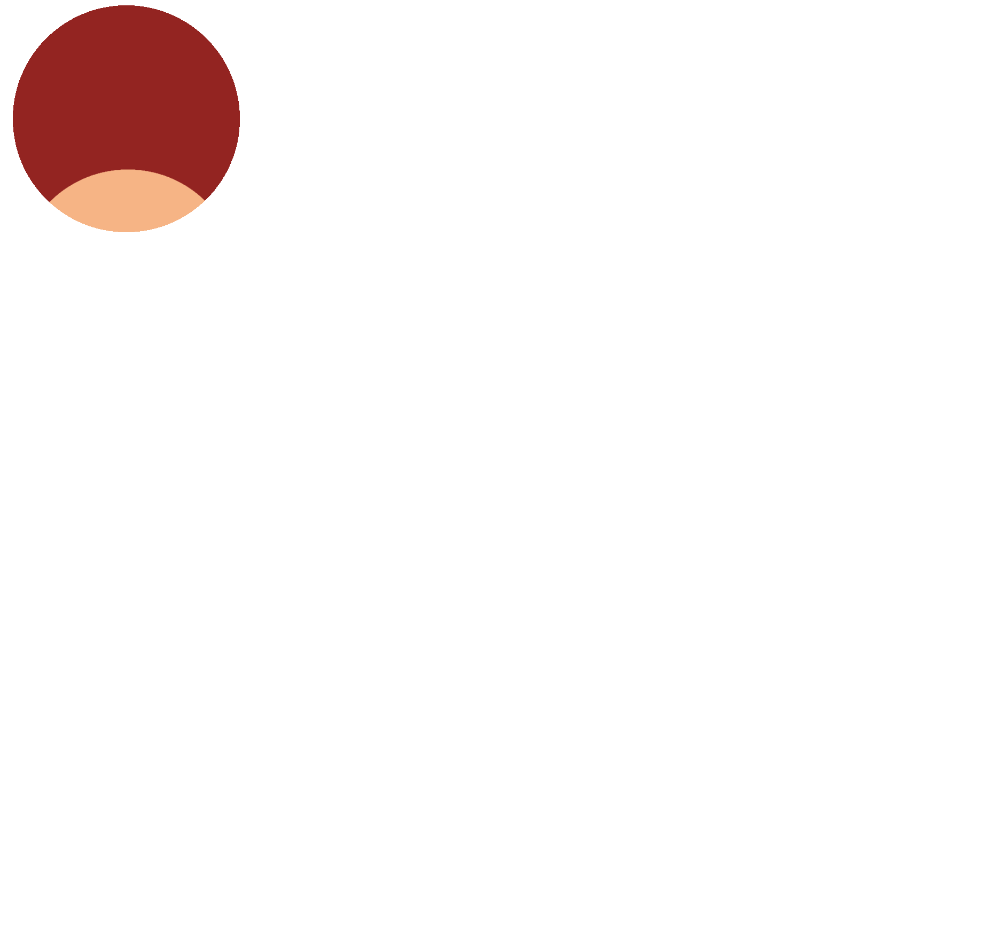

# ДАВО "Заря" - Децентрализованная автономная внутрипартийная организация

[](LICENSE)
[](https://github.com/Rassvet-CEC-ITD/zarya/issues)
[](https://github.com/Rassvet-CEC-ITD/zarya/stargazers)

> **Математически формализованное мнение партии через блокчейн-голосование**

Система для автоматизации управления мнением партии "Рассвет" с использованием технологий DAO и статистического анализа.

## 📋 Содержание

- [📖 Описание проекта](#-описание-проекта)
- [🎯 Мотивация](#-мотивация) 
- [🧮 Математическая модель](#-математическая-модель)
- [⚡ Архитектура DAO](#-архитектура-dao)
- [📊 Примеры работы](#-примеры-работы)
- [🔮 Прогнозирование](#-прогнозирование)
- [🛠️ Технологический стек](#️-технологический-стек)

## 📖 Описание проекта

**ДАВО "Заря"** — распределённое ПО для формализации и анализа мнения партии "Рассвет" через математические методы и блокчейн-голосование.

### 🎯 Ключевые возможности

- 🧮 **Математическая формализация** мнения через матрицы случайных величин
- 🗳️ **DAO-голосование** с соответствием Уставу партии  
- 📊 **Статистический анализ** и агрегация мнений
- 📝 **Автогенерация** человекочитаемых документов
- 🔮 **Прогнозирование** изменений позиции партии

## 🎯 Мотивация

### Проблемы современных партий:

1. **Неэффективные консультации** - непредсказуемая длительность и качество обсуждений
2. **Бюрократическая нагрузка** - постоянные созывы органов для выяснения мнения
3. **Хаос документооборота** - бесконечные поправки и версии документов
4. **Фейковые новости и дезинформация** - сложно проверить достоверность заявлений и позиций без статистического анализа

### Решение через "Зарю":

- **Статистически обоснованные рекомендации** с заданной точностью
- **Фильтрация вопросов** и снижение бюрократической нагрузки  
- **Единая актуальная позиция** без версионности документов
- **Верификация через тестирование гипотез** - проверка соответствия заявлений реальному мнению партии

## 🧮 Математическая модель

Мнение партии формализуется как кортеж из двух матриц:

$$
\mathcal{M} = (\mathbf{X}, \mathbf{Y})
$$

где:
- $\mathbf{X}$ — матрица **непрерывных случайных величин** (количественные оценки)
- $\mathbf{Y}$ — матрица **дискретных случайных величин** (категориальные суждения)

### Эмпирическая реализация

В реальной системе используются накапливаемые выборки:

$$
M = (S_X, S_Y)
$$

Агрегирование через функцию:
$$
\hat{M} = f(S_X, S_Y)
$$

**Пример выборки:**
- Уровень безработицы: `{5.4, 5.6, 6.0, 4.9, 5.2}` → Среднее: `5.34%`
- Отношение к реформе: `{"приемлемо", "желательно", "приемлемо"}` → Мода: `"приемлемо" (67%)`

## ⚡ Архитектура DAO

### Поддерживаемые органы

| Орган                                  | Код        | Представляет                  | Тип голосования                    |
| -------------------------------------- | ---------- | ----------------------------- | ---------------------------------- |
| Съезд партии                           | `СЗД`      | Делегаты от >50% субъектов РФ | Общепартийный                      |
| Председатель                           | `ПРЛ`      | Себя                          | Без голосования                    |
| Центральный совет                      | `СОВ`      | Члены Центрального совета     | Межсъездовый орган                 |
| Региональная конференция               | `НН.КОН`   | Делегаты от >50% МО в регионе | Высший орган региона               |
| Общее собрание регионального отделения | `НН.ОБС`   | Все члены РО                  | Высший орган региона               |
| Совет регионального отделения          | `НН.СОВ`   | Совет РО (если избран)        | Постоянно действующий региональный |
| Общее собрание местного отделения      | `НН.Х.ОБС` | Все члены МО                  | Основной орган на местах           |
| Совет местного отделения               | `НН.Х.СОВ` | Совет МО (если избран)        | Делегированное управление МО       |

## 📊 Примеры работы

<details>
<summary><b>🌱 Экологическая инициатива</b></summary>

**Ячейка:** `Y[15][3]` - "Экология — 74.2.СОВ"  
**Новое значение:** `"приемлемо"`  
**Результат голосования:** Утверждено МО №2 Челябинской области  

**Агрегированный результат:**
- "приемлемо": 72%
- "сомнительно": 18%  
- "неприемлемо": 10%

**Автосгенерированный текст:**
> "Совет МО №2 Челябинской области считает экологические последствия рекультивации свалок приемлемыми (поддержка — 72% участников)."

</details>

## 🔮 Прогнозирование

### Проверка нулевой гипотезы (H₀)

Система предсказывает изменение мнения **до** голосования:

```python
def predict_change(current_sample, new_value):
    new_sample = current_sample + [new_value]
    return will_opinion_change(new_sample)
```

**Пример:** Если добавить значение `20%` к выборке налоговой нагрузки `[13.5, 14.0, 14.2, 15.1]`:
- Новое среднее: `15.36%` 
- **H₀ нарушена** → мнение партии изменится

## 🛠️ Технологический стек

### Блокчейн
- **Solidity** + **Hardhat** - смарт-контракты

### Frontend  
- **React** + **Wagmi** - пользовательский интерфейс

### Backend
- **Python** + **Django/Flask** - API сервер
- **Pandas** + **scikit-learn** - статистический анализ

## 🔗 Полезные ссылки

- **[Презентация](https://docs.google.com/presentation/d/1mRsgTg3XsrVSvXpRoXnVyLOgX2QSJKPEfJUwnsZz_Uk/edit?usp=sharing)** - детальный обзор системы

## 🤝 Участие в проекте

1. 🍴 Fork репозитория
2. 🔨 Внесите изменения  
3. 📤 Создайте pull request

<div align="center">
<b>Сделано с ❤️ для партии "Рассвет"</b><br>
<sub>Версия: Челябинск | 2025</sub>
</div>